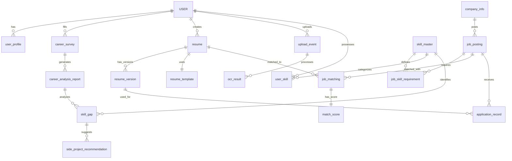

# Career Pilot 資料庫結構完整文件

> **生成時間**: 2026-01-31 07:50:19  
> **資料來源**: Supabase 實際資料庫結構  
> **用途**: 資料庫災難復原參考

---

## 📊 資料庫概覽

- **總表數**: 19 張
- **總欄位數**: 161 個
- **外鍵關係**: 20 個
- **唯一約束**: 6 個

---

## 📋 資料表清單

1. **job_posting** (20 個欄位)
2. **career_survey** (11 個欄位)
3. **resume** (11 個欄位)
4. **user_profile** (10 個欄位)
5. **side_project_recommendation** (9 個欄位)
6. **application_record** (9 個欄位)
7. **ocr_result** (9 個欄位)
8. **upload_event** (8 個欄位)
9. **career_analysis_report** (8 個欄位)
10. **match_score** (8 個欄位)
11. **company_info** (8 個欄位)
12. **skill_gap** (8 個欄位)
13. **USER** (7 個欄位)
14. **user_skill** (7 個欄位)
15. **resume_version** (7 個欄位)
16. **job_matching** (6 個欄位)
17. **job_skill_requirement** (5 個欄位)
18. **resume_template** (5 個欄位)
19. **skill_master** (5 個欄位)

---

## USER

| # | 欄位名稱 | 資料型態 | 長度 | 可空值 | 預設值 | 主鍵 | 外鍵 | 唯一 |
|---|---------|---------|------|-------|-------|------|------|------|
| 1 | `user_id` | integer | - | ✗ | nextval('"USER_user_id_seq"':: | 🔑 |  |  |
| 2 | `email` | character varying | 255.0 | ✗ | - |  |  | ⭐ |
| 3 | `password_hash` | character varying | 255.0 | ✗ | - |  |  |  |
| 4 | `auth_provider` | character varying | 50.0 | ✓ | 'Email'::character varying |  |  |  |
| 5 | `created_at` | timestamp with time zone | - | ✗ | now() |  |  |  |
| 6 | `last_login` | timestamp with time zone | - | ✓ | - |  |  |  |
| 7 | `is_active` | boolean | - | ✓ | true |  |  |  |

---

## application_record

| # | 欄位名稱 | 資料型態 | 長度 | 可空值 | 預設值 | 主鍵 | 外鍵 | 唯一 |
|---|---------|---------|------|-------|-------|------|------|------|
| 1 | `application_id` | integer | - | ✗ | nextval('application_record_ap | 🔑 |  |  |
| 2 | `user_id` | integer | - | ✓ | - |  | → USER.user_id |  |
| 3 | `job_id` | integer | - | ✓ | - |  | → job_posting.job_id |  |
| 4 | `version_id` | integer | - | ✓ | - |  | → resume_version.version_id |  |
| 5 | `application_status` | character varying | 50.0 | ✓ | 'applied'::character varying |  |  |  |
| 6 | `applied_at` | timestamp with time zone | - | ✗ | now() |  |  |  |
| 7 | `status_updated_at` | timestamp with time zone | - | ✓ | - |  |  |  |
| 8 | `days_since_application` | integer | - | ✓ | - |  |  |  |
| 9 | `user_feedback` | jsonb | - | ✓ | - |  |  |  |

**外鍵約束**:
- `user_id` → `USER.user_id` (DELETE: NO ACTION, UPDATE: NO ACTION)
- `job_id` → `job_posting.job_id` (DELETE: NO ACTION, UPDATE: NO ACTION)
- `version_id` → `resume_version.version_id` (DELETE: NO ACTION, UPDATE: NO ACTION)

---

## career_analysis_report

| # | 欄位名稱 | 資料型態 | 長度 | 可空值 | 預設值 | 主鍵 | 外鍵 | 唯一 |
|---|---------|---------|------|-------|-------|------|------|------|
| 1 | `report_id` | integer | - | ✗ | nextval('career_analysis_repor | 🔑 |  |  |
| 2 | `survey_id` | integer | - | ✓ | - |  | → career_survey.survey_id |  |
| 3 | `resume_id` | integer | - | ✓ | - |  |  |  |
| 4 | `skill_gap_analysis` | jsonb | - | ✓ | - |  |  |  |
| 5 | `career_path_suggestions` | jsonb | - | ✓ | - |  |  |  |
| 6 | `market_insights` | jsonb | - | ✓ | - |  |  |  |
| 7 | `career_readiness_score` | double precision | - | ✓ | - |  |  |  |
| 8 | `generated_at` | timestamp with time zone | - | ✓ | now() |  |  |  |

**外鍵約束**:
- `survey_id` → `career_survey.survey_id` (DELETE: NO ACTION, UPDATE: NO ACTION)

---

## career_survey

| # | 欄位名稱 | 資料型態 | 長度 | 可空值 | 預設值 | 主鍵 | 外鍵 | 唯一 |
|---|---------|---------|------|-------|-------|------|------|------|
| 1 | `survey_id` | integer | - | ✗ | nextval('career_survey_survey_ | 🔑 |  |  |
| 2 | `user_id` | integer | - | ✓ | - |  | → USER.user_id |  |
| 3 | `career_preference` | jsonb | - | ✓ | - |  |  |  |
| 4 | `skill_self_assessment` | jsonb | - | ✓ | - |  |  |  |
| 5 | `salary_min` | integer | - | ✓ | - |  |  |  |
| 6 | `salary_max` | integer | - | ✓ | - |  |  |  |
| 7 | `location_preference` | character varying | 100.0 | ✓ | - |  |  |  |
| 8 | `remote_preference` | character varying | 50.0 | ✓ | - |  |  |  |
| 9 | `career_motivation` | jsonb | - | ✓ | - |  |  |  |
| 10 | `completed_at` | timestamp with time zone | - | ✓ | - |  |  |  |
| 11 | `updated_at` | timestamp with time zone | - | ✓ | now() |  |  |  |

**外鍵約束**:
- `user_id` → `USER.user_id` (DELETE: NO ACTION, UPDATE: NO ACTION)

---

## company_info

| # | 欄位名稱 | 資料型態 | 長度 | 可空值 | 預設值 | 主鍵 | 外鍵 | 唯一 |
|---|---------|---------|------|-------|-------|------|------|------|
| 1 | `company_id` | integer | - | ✗ | nextval('company_info_company_ | 🔑 |  |  |
| 2 | `company_name` | character varying | 200.0 | ✗ | - |  |  | ⭐ |
| 3 | `industry` | character varying | 100.0 | ✓ | - |  |  |  |
| 4 | `company_size` | character varying | 50.0 | ✓ | - |  |  |  |
| 5 | `location` | character varying | 200.0 | ✓ | - |  |  |  |
| 6 | `website` | character varying | 500.0 | ✓ | - |  |  |  |
| 7 | `description` | text | - | ✓ | - |  |  |  |
| 8 | `created_at` | timestamp with time zone | - | ✓ | now() |  |  |  |

---

## job_matching

| # | 欄位名稱 | 資料型態 | 長度 | 可空值 | 預設值 | 主鍵 | 外鍵 | 唯一 |
|---|---------|---------|------|-------|-------|------|------|------|
| 1 | `matching_id` | integer | - | ✗ | nextval('job_matching_matching | 🔑 |  |  |
| 2 | `resume_id` | integer | - | ✓ | - |  |  |  |
| 3 | `job_id` | integer | - | ✓ | - |  | → job_posting.job_id |  |
| 4 | `overall_match_score` | double precision | - | ✓ | - |  |  |  |
| 5 | `matching_algorithm` | character varying | 50.0 | ✓ | - |  |  |  |
| 6 | `matched_at` | timestamp with time zone | - | ✓ | now() |  |  |  |

**外鍵約束**:
- `job_id` → `job_posting.job_id` (DELETE: NO ACTION, UPDATE: NO ACTION)

---

## job_posting

| # | 欄位名稱 | 資料型態 | 長度 | 可空值 | 預設值 | 主鍵 | 外鍵 | 唯一 |
|---|---------|---------|------|-------|-------|------|------|------|
| 1 | `job_id` | integer | - | ✗ | nextval('job_posting_job_id_se | 🔑 |  |  |
| 2 | `company_id` | integer | - | ✓ | - |  | → company_info.company_id |  |
| 3 | `job_title` | character varying | 200.0 | ✓ | - |  |  |  |
| 4 | `job_description` | text | - | ✓ | - |  |  |  |
| 5 | `requirements` | text | - | ✓ | - |  |  |  |
| 6 | `salary_min` | integer | - | ✓ | - |  |  |  |
| 7 | `salary_max` | integer | - | ✓ | - |  |  |  |
| 9 | `remote_option` | character varying | 50.0 | ✓ | - |  |  |  |
| 10 | `job_details` | jsonb | - | ✓ | - |  |  |  |
| 11 | `source_platform` | character varying | 50.0 | ✓ | - |  |  |  |
| 12 | `source_url` | character varying | 500.0 | ✓ | - |  |  | ⭐ |
| 13 | `posted_date` | date | - | ✓ | - |  |  |  |
| 14 | `scraped_at` | timestamp with time zone | - | ✓ | now() |  |  |  |
| 15 | `is_active` | boolean | - | ✓ | true |  |  |  |
| 16 | `vector_id` | uuid | - | ✓ | - |  |  |  |
| 17 | `is_embedded` | boolean | - | ✓ | false |  |  |  |
| 18 | `city` | character varying | 50.0 | ✓ | - |  |  |  |
| 19 | `district` | character varying | 50.0 | ✓ | - |  |  |  |
| 20 | `full_address` | character varying | 255.0 | ✓ | - |  |  |  |
| 21 | `job_category` | text | - | ✓ | - |  |  |  |

**外鍵約束**:
- `company_id` → `company_info.company_id` (DELETE: NO ACTION, UPDATE: NO ACTION)

---

## job_skill_requirement

| # | 欄位名稱 | 資料型態 | 長度 | 可空值 | 預設值 | 主鍵 | 外鍵 | 唯一 |
|---|---------|---------|------|-------|-------|------|------|------|
| 1 | `requirement_id` | integer | - | ✗ | nextval('job_skill_requirement | 🔑 |  |  |
| 2 | `job_id` | integer | - | ✓ | - |  | → job_posting.job_id |  |
| 3 | `skill_id` | integer | - | ✓ | - |  | → skill_master.skill_id |  |
| 4 | `importance` | character varying | 50.0 | ✓ | - |  |  |  |
| 5 | `proficiency_level` | integer | - | ✓ | - |  |  |  |

**外鍵約束**:
- `job_id` → `job_posting.job_id` (DELETE: NO ACTION, UPDATE: NO ACTION)
- `skill_id` → `skill_master.skill_id` (DELETE: NO ACTION, UPDATE: NO ACTION)

---

## match_score

| # | 欄位名稱 | 資料型態 | 長度 | 可空值 | 預設值 | 主鍵 | 外鍵 | 唯一 |
|---|---------|---------|------|-------|-------|------|------|------|
| 1 | `score_id` | integer | - | ✗ | nextval('match_score_score_id_ | 🔑 |  |  |
| 2 | `matching_id` | integer | - | ✓ | - |  | → job_matching.matching_id | ⭐ |
| 3 | `skill_match_score` | double precision | - | ✓ | - |  |  |  |
| 4 | `experience_match_score` | double precision | - | ✓ | - |  |  |  |
| 5 | `salary_match_score` | double precision | - | ✓ | - |  |  |  |
| 6 | `location_match_score` | double precision | - | ✓ | - |  |  |  |
| 7 | `score_breakdown` | jsonb | - | ✓ | - |  |  |  |
| 8 | `created_at` | timestamp with time zone | - | ✓ | now() |  |  |  |

**外鍵約束**:
- `matching_id` → `job_matching.matching_id` (DELETE: NO ACTION, UPDATE: NO ACTION)

---

## ocr_result

| # | 欄位名稱 | 資料型態 | 長度 | 可空值 | 預設值 | 主鍵 | 外鍵 | 唯一 |
|---|---------|---------|------|-------|-------|------|------|------|
| 1 | `ocr_id` | integer | - | ✗ | nextval('ocr_result_ocr_id_seq | 🔑 |  |  |
| 2 | `event_id` | integer | - | ✓ | - |  | → upload_event.event_id |  |
| 3 | `resume_id` | integer | - | ✓ | - |  |  |  |
| 4 | `raw_text` | text | - | ✓ | - |  |  |  |
| 5 | `extracted_data` | jsonb | - | ✓ | - |  |  |  |
| 6 | `confidence_score` | double precision | - | ✓ | - |  |  |  |
| 7 | `is_manual_review_needed` | boolean | - | ✓ | false |  |  |  |
| 8 | `ocr_status` | character varying | 50.0 | ✓ | - |  |  |  |
| 9 | `processed_at` | timestamp with time zone | - | ✓ | now() |  |  |  |

**外鍵約束**:
- `event_id` → `upload_event.event_id` (DELETE: NO ACTION, UPDATE: NO ACTION)

---

## resume

| # | 欄位名稱 | 資料型態 | 長度 | 可空值 | 預設值 | 主鍵 | 外鍵 | 唯一 |
|---|---------|---------|------|-------|-------|------|------|------|
| 1 | `resume_id` | integer | - | ✗ | nextval('resume_resume_id_seq' | 🔑 |  |  |
| 2 | `user_id` | integer | - | ✓ | - |  | → USER.user_id |  |
| 3 | `template_id` | integer | - | ✓ | - |  | → resume_template.template_id |  |
| 4 | `resume_type` | character varying | 50.0 | ✗ | - |  |  |  |
| 5 | `structured_data` | jsonb | - | ✓ | - |  |  |  |
| 6 | `normalized_data` | jsonb | - | ✓ | - |  |  |  |
| 7 | `vector_id` | uuid | - | ✓ | - |  |  |  |
| 8 | `is_embedded` | boolean | - | ✓ | false |  |  |  |
| 9 | `is_primary` | boolean | - | ✓ | false |  |  |  |
| 10 | `created_at` | timestamp with time zone | - | ✗ | now() |  |  |  |
| 11 | `updated_at` | timestamp with time zone | - | ✓ | now() |  |  |  |

**外鍵約束**:
- `user_id` → `USER.user_id` (DELETE: CASCADE, UPDATE: NO ACTION)
- `template_id` → `resume_template.template_id` (DELETE: NO ACTION, UPDATE: NO ACTION)

---

## resume_template

| # | 欄位名稱 | 資料型態 | 長度 | 可空值 | 預設值 | 主鍵 | 外鍵 | 唯一 |
|---|---------|---------|------|-------|-------|------|------|------|
| 1 | `template_id` | integer | - | ✗ | nextval('resume_template_templ | 🔑 |  |  |
| 2 | `template_name` | character varying | 100.0 | ✗ | - |  |  |  |
| 3 | `template_type` | character varying | 50.0 | ✓ | - |  |  |  |
| 4 | `template_structure` | jsonb | - | ✓ | - |  |  |  |
| 5 | `created_at` | timestamp with time zone | - | ✗ | now() |  |  |  |

---

## resume_version

| # | 欄位名稱 | 資料型態 | 長度 | 可空值 | 預設值 | 主鍵 | 外鍵 | 唯一 |
|---|---------|---------|------|-------|-------|------|------|------|
| 1 | `version_id` | integer | - | ✗ | nextval('resume_version_versio | 🔑 |  |  |
| 2 | `resume_id` | integer | - | ✓ | - |  |  |  |
| 3 | `version_number` | integer | - | ✗ | - |  |  |  |
| 4 | `file_path` | character varying | 255.0 | ✓ | - |  |  |  |
| 5 | `content` | jsonb | - | ✓ | - |  |  |  |
| 6 | `optimization_target` | character varying | 100.0 | ✓ | - |  |  |  |
| 7 | `created_at` | timestamp with time zone | - | ✗ | now() |  |  |  |

---

## side_project_recommendation

| # | 欄位名稱 | 資料型態 | 長度 | 可空值 | 預設值 | 主鍵 | 外鍵 | 唯一 |
|---|---------|---------|------|-------|-------|------|------|------|
| 1 | `recommendation_id` | integer | - | ✗ | nextval('side_project_recommen | 🔑 |  |  |
| 2 | `gap_id` | integer | - | ✓ | - |  | → skill_gap.gap_id |  |
| 3 | `project_name` | character varying | 200.0 | ✓ | - |  |  |  |
| 4 | `project_description` | text | - | ✓ | - |  |  |  |
| 5 | `required_skills` | jsonb | - | ✓ | - |  |  |  |
| 6 | `difficulty_level` | character varying | 50.0 | ✓ | - |  |  |  |
| 7 | `estimated_hours` | integer | - | ✓ | - |  |  |  |
| 8 | `project_url` | character varying | 500.0 | ✓ | - |  |  |  |
| 9 | `created_at` | timestamp with time zone | - | ✓ | now() |  |  |  |

**外鍵約束**:
- `gap_id` → `skill_gap.gap_id` (DELETE: NO ACTION, UPDATE: NO ACTION)

---

## skill_gap

| # | 欄位名稱 | 資料型態 | 長度 | 可空值 | 預設值 | 主鍵 | 外鍵 | 唯一 |
|---|---------|---------|------|-------|-------|------|------|------|
| 1 | `gap_id` | integer | - | ✗ | nextval('skill_gap_gap_id_seq' | 🔑 |  |  |
| 2 | `report_id` | integer | - | ✓ | - |  | → career_analysis_report.report_id |  |
| 3 | `skill_id` | integer | - | ✓ | - |  | → skill_master.skill_id |  |
| 4 | `current_level` | integer | - | ✓ | - |  |  |  |
| 5 | `target_level` | integer | - | ✓ | - |  |  |  |
| 6 | `priority_rank` | integer | - | ✓ | - |  |  |  |
| 7 | `time_investment_hours` | double precision | - | ✓ | - |  |  |  |
| 8 | `skill_roi_score` | double precision | - | ✓ | - |  |  |  |

**外鍵約束**:
- `report_id` → `career_analysis_report.report_id` (DELETE: NO ACTION, UPDATE: NO ACTION)
- `skill_id` → `skill_master.skill_id` (DELETE: NO ACTION, UPDATE: NO ACTION)

---

## skill_master

| # | 欄位名稱 | 資料型態 | 長度 | 可空值 | 預設值 | 主鍵 | 外鍵 | 唯一 |
|---|---------|---------|------|-------|-------|------|------|------|
| 1 | `skill_id` | integer | - | ✗ | nextval('skill_master_skill_id | 🔑 |  |  |
| 2 | `skill_name` | character varying | 100.0 | ✗ | - |  |  | ⭐ |
| 3 | `skill_category` | character varying | 50.0 | ✓ | - |  |  |  |
| 4 | `synonyms` | jsonb | - | ✓ | - |  |  |  |
| 5 | `created_at` | timestamp with time zone | - | ✓ | now() |  |  |  |

---

## upload_event

| # | 欄位名稱 | 資料型態 | 長度 | 可空值 | 預設值 | 主鍵 | 外鍵 | 唯一 |
|---|---------|---------|------|-------|-------|------|------|------|
| 1 | `event_id` | integer | - | ✗ | nextval('upload_event_event_id | 🔑 |  |  |
| 2 | `user_id` | integer | - | ✓ | - |  | → USER.user_id |  |
| 3 | `file_name` | character varying | 255.0 | ✗ | - |  |  |  |
| 4 | `file_path` | character varying | 500.0 | ✗ | - |  |  |  |
| 5 | `upload_type` | character varying | 50.0 | ✓ | - |  |  |  |
| 6 | `status` | character varying | 50.0 | ✓ | 'pending'::character varying |  |  |  |
| 7 | `uploaded_at` | timestamp with time zone | - | ✗ | now() |  |  |  |
| 8 | `metadata` | jsonb | - | ✓ | - |  |  |  |

**外鍵約束**:
- `user_id` → `USER.user_id` (DELETE: NO ACTION, UPDATE: NO ACTION)

---

## user_profile

| # | 欄位名稱 | 資料型態 | 長度 | 可空值 | 預設值 | 主鍵 | 外鍵 | 唯一 |
|---|---------|---------|------|-------|-------|------|------|------|
| 1 | `profile_id` | integer | - | ✗ | nextval('user_profile_profile_ | 🔑 |  |  |
| 2 | `user_id` | integer | - | ✓ | - |  | → USER.user_id | ⭐ |
| 3 | `github_repo` | character varying | 100.0 | ✓ | - |  |  |  |
| 4 | `full_name` | character varying | 100.0 | ✓ | - |  |  |  |
| 5 | `location` | character varying | 100.0 | ✓ | - |  |  |  |
| 6 | `years_of_experience` | integer | - | ✓ | - |  |  |  |
| 7 | `current_position` | character varying | 100.0 | ✓ | - |  |  |  |
| 8 | `education_background` | text | - | ✓ | - |  |  |  |
| 9 | `privacy_settings` | jsonb | - | ✓ | - |  |  |  |
| 10 | `updated_at` | timestamp with time zone | - | ✓ | now() |  |  |  |

**外鍵約束**:
- `user_id` → `USER.user_id` (DELETE: CASCADE, UPDATE: NO ACTION)

---

## user_skill

| # | 欄位名稱 | 資料型態 | 長度 | 可空值 | 預設值 | 主鍵 | 外鍵 | 唯一 |
|---|---------|---------|------|-------|-------|------|------|------|
| 1 | `user_skill_id` | integer | - | ✗ | nextval('user_skill_user_skill | 🔑 |  |  |
| 2 | `user_id` | integer | - | ✓ | - |  | → USER.user_id |  |
| 3 | `skill_id` | integer | - | ✓ | - |  | → skill_master.skill_id |  |
| 4 | `proficiency_level` | integer | - | ✓ | - |  |  |  |
| 5 | `years_of_experience` | double precision | - | ✓ | - |  |  |  |
| 6 | `verified` | boolean | - | ✓ | false |  |  |  |
| 7 | `created_at` | timestamp with time zone | - | ✓ | now() |  |  |  |

**外鍵約束**:
- `user_id` → `USER.user_id` (DELETE: NO ACTION, UPDATE: NO ACTION)
- `skill_id` → `skill_master.skill_id` (DELETE: NO ACTION, UPDATE: NO ACTION)

---

## 🔗 外鍵關係總覽



---

## 📌 關鍵欄位說明

### 向量化相關欄位
- `resume.vector_id` (UUID): 履歷向量化 ID，指向 Qdrant
- `resume.is_embedded` (BOOLEAN): 是否已完成向量化
- `job_posting.vector_id` (UUID): 職缺向量化 ID
- `job_posting.is_embedded` (BOOLEAN): 是否已完成向量化

### JSONB 欄位
- `application_record.user_feedback`
- `career_analysis_report.skill_gap_analysis`
- `career_analysis_report.career_path_suggestions`
- `career_analysis_report.market_insights`
- `career_survey.career_preference`
- `career_survey.skill_self_assessment`
- `career_survey.career_motivation`
- `job_posting.job_details`
- `match_score.score_breakdown`
- `ocr_result.extracted_data`
- `resume.structured_data`
- `resume.normalized_data`
- `resume_template.template_structure`
- `resume_version.content`
- `side_project_recommendation.required_skills`
- `skill_master.synonyms`
- `upload_event.metadata`
- `user_profile.privacy_settings`


---

## ⚠️ 重要注意事項

### 1. job_posting 表欄位順序問題
- `ordinal_position` 從 7 跳到 9，缺少 position 8
- 原因：可能是某個欄位被刪除但順序未重新排列
- 影響：不影響功能，但建議重建表以修正

### 2. 外鍵刪除規則
- `resume.user_id`: CASCADE（刪除使用者時同步刪除履歷）
- `user_profile.user_id`: CASCADE（刪除使用者時同步刪除個人檔案）
- 其他外鍵: NO ACTION（禁止刪除有關聯的記錄）

### 3. 唯一約束
- `USER.email`
- `company_info.company_name`
- `job_posting.source_url`
- `match_score.matching_id`
- `skill_master.skill_name`
- `user_profile.user_id`


---

## 🔧 災難復原步驟

### 1. 使用備份 SQL 重建結構
```sql
-- 執行 db_schema_backup.sql
-- 該檔案包含完整的 CREATE TABLE 語句
```

### 2. 驗證表結構
```sql
-- 檢查所有表
SELECT table_name FROM information_schema.tables 
WHERE table_schema = 'public' AND table_type = 'BASE TABLE'
ORDER BY table_name;

-- 應該要有 19 張表
```

### 3. 檢查外鍵關係
```sql
SELECT 
    tc.table_name,
    kcu.column_name,
    ccu.table_name AS foreign_table_name,
    ccu.column_name AS foreign_column_name
FROM information_schema.table_constraints AS tc
JOIN information_schema.key_column_usage AS kcu
    ON tc.constraint_name = kcu.constraint_name
JOIN information_schema.constraint_column_usage AS ccu
    ON ccu.constraint_name = tc.constraint_name
WHERE tc.constraint_type = 'FOREIGN KEY'
ORDER BY tc.table_name;

-- 應該要有 20 個外鍵關係
```

### 4. 重新匯入資料
- 順序：先匯入主表（USER, company_info, skill_master 等）
- 再匯入關聯表（resume, job_posting 等）
- 最後匯入衍生資料（job_matching, match_score 等）

---

## 📝 更新記錄

### 最新更新（與說明書v4對照）
- ✅ 19 張表完全符合
- ✅ job_posting 新增 `job_category`, `city`, `district`, `full_address`
- ✅ 20 個外鍵關係完整
- ✅ 所有唯一約束正確設定

---

## 📞 聯絡資訊

如需修改資料庫結構，請參考：
- ERD 設計文件: `career_pilot說明文件v4_with_chinese.md`
- 備份 SQL: `db_schema_backup.sql`
- 本文件: `database_structure_complete.md`

**最後更新**: {datetime.now().strftime('%Y-%m-%d')}
