# Mermaid ERD 關聯動詞（Relationship Labels）完全解析

## 🎯 什麼是關聯動詞？

### 基本語法

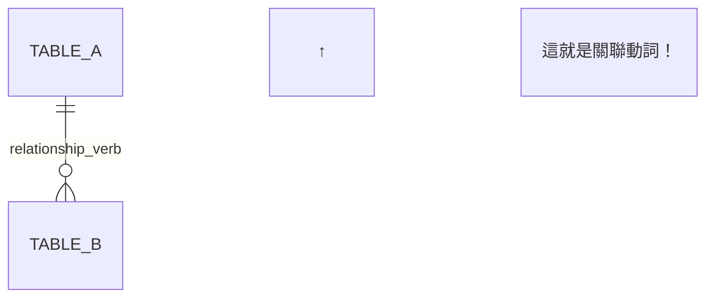

**作用**：
- 讓 ERD 圖更易讀
- 說明「主表對從表做了什麼」
- 用**現在式動詞**描述業務關係

---

## 📖 Career Pilot 中的關聯動詞清單

### 完整對照表

| 關聯動詞 | 中文 | 主表 | 從表 | 業務意義 |
|---------|-----|------|------|---------|
| `creates` | 建立 | USER | RESUME | 使用者**建立**履歷 |
| `completes` | 完成 | USER | CAREER_SURVEY | 使用者**完成**問卷 |
| `has` | 擁有 | USER | USER_PROFILE | 使用者**擁有**個人檔案 |
| `triggers` | 觸發 | USER | UPLOAD_EVENT | 使用者**觸發**上傳事件 |
| `submits` | 提交 | USER | APPLICATION_RECORD | 使用者**提交**投遞記錄 |
| `uses` | 使用 | RESUME | RESUME_TEMPLATE | 履歷**使用**模板 |
| `participates_in` | 參與 | RESUME | JOB_MATCHING | 履歷**參與**職缺媒合 |
| `parsed_by` | 被解析 | RESUME | OCR_RESULT | 履歷**被** OCR **解析** |
| `produces` | 產生 | UPLOAD_EVENT | OCR_RESULT | 上傳事件**產生** OCR 結果 |
| `belongs_to` | 屬於 | JOB_POSTING | COMPANY_INFO | 職缺**屬於**公司 |
| `matches_with` | 匹配 | JOB_POSTING | JOB_MATCHING | 職缺**匹配**媒合記錄 |
| `receives` | 接收 | JOB_POSTING | APPLICATION_RECORD | 職缺**接收**投遞 |
| `requires` | 需要 | JOB_POSTING | JOB_SKILL_REQUIREMENT | 職缺**需要**技能 |
| `defines` | 定義 | SKILL_MASTER | JOB_SKILL_REQUIREMENT | 技能主檔**定義**技能需求 |
| `contains` | 包含 | USER_PROFILE | USER_SKILL | 個人檔案**包含**技能 |
| `identifies` | 識別 | CAREER_ANALYSIS_REPORT | SKILL_GAP | 分析報告**識別**技能落差 |
| `suggests` | 建議 | SKILL_GAP | SIDE_PROJECT_RECOMMENDATION | 技能落差**建議**專案 |
| `generates` | 生成 | CAREER_SURVEY | CAREER_ANALYSIS_REPORT | 問卷**生成**分析報告 |
| `analyzes` | 分析 | RESUME | CAREER_ANALYSIS_REPORT | 履歷**被分析**產生報告 |
| `guides` | 指導 | CAREER_SURVEY | RESUME | 問卷**指導**履歷生成 |

---

## 🔍 詳細解析：常見關聯動詞

### 1. `defines` - 定義

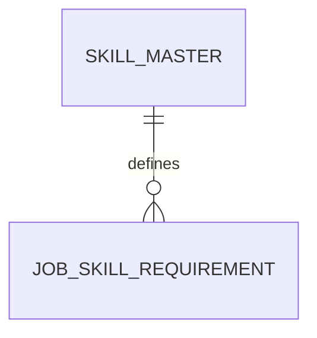

**完整句子**：
- SKILL_MASTER **defines** JOB_SKILL_REQUIREMENT
- 技能主檔**定義**職缺技能需求

**業務意義**：
- `SKILL_MASTER` 是技能的**標準定義**
- `JOB_SKILL_REQUIREMENT` 引用這些定義
- 就像字典**定義**單字的意思

**為什麼用 `defines` 而不是其他？**
- ❌ `has`：太籠統，沒有明確意義
- ❌ `creates`：技能主檔不是「創造」需求
- ✅ `defines`：強調「標準化定義」的角色

---

### 2. `requires` - 需要

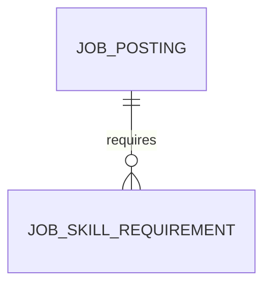

**完整句子**：
- JOB_POSTING **requires** JOB_SKILL_REQUIREMENT
- 職缺**需要**（某些）技能

**業務意義**：
- 職缺對技能有**需求**
- 這是主動的需求關係
- 強調「職缺的要求」

**為什麼用 `requires` 而不是其他？**
- ❌ `has`：不夠精確，「擁有」不等於「需要」
- ❌ `contains`：職缺不是「包含」技能
- ✅ `requires`：明確表達「需求」的概念

---

### 3. `belongs_to` - 屬於

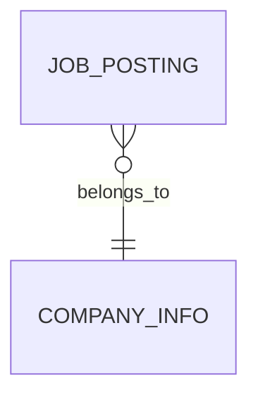

**完整句子**：
- JOB_POSTING **belongs_to** COMPANY_INFO
- 職缺**屬於**公司

**業務意義**：
- 表達「從屬關係」
- 職缺是公司的一部分
- 強調「歸屬」概念

**為什麼用 `belongs_to` 而不是其他？**
- ❌ `has`：方向相反（應該是公司 has 職缺）
- ❌ `creates`：公司不是「創造」職缺（雖然實際上是）
- ✅ `belongs_to`：從職缺的角度，它「屬於」某公司

**注意方向**：
```
正向：COMPANY_INFO ||--o{ JOB_POSTING : publishes
反向：JOB_POSTING }o--|| COMPANY_INFO : belongs_to
```

---

### 4. `creates` - 建立


**完整句子**：
- USER **creates** RESUME
- 使用者**建立**履歷

**業務意義**：
- 強調「創造」的動作
- 使用者是主動方
- 履歷是被創造的產物

**類似動詞**：
- `generates`：由系統自動生成
- `produces`：產生（較機械化）
- `creates`：人為創造（較有主動性）

---

### 5. `has` - 擁有

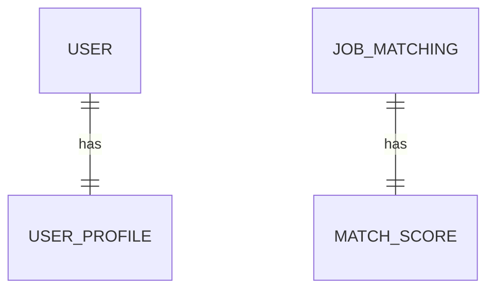

**完整句子**：
- USER **has** USER_PROFILE
- 使用者**擁有**個人檔案

**業務意義**：
- 最通用的關聯動詞
- 表達「擁有」或「包含」關係
- 適合一對一關係

**什麼時候用 `has`？**
- 關係比較抽象，沒有更精確的動詞時
- 一對一關係（每個都有一個）
- 不強調特定業務動作

---

### 6. `participates_in` - 參與

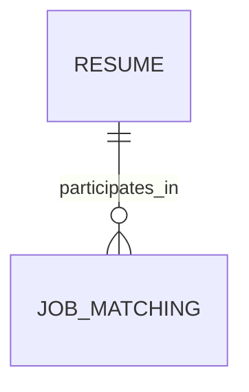

**完整句子**：
- RESUME **participates_in** JOB_MATCHING
- 履歷**參與**職缺媒合

**業務意義**：
- 強調「參與」某個過程
- 履歷不是主動「創造」媒合，而是「被用於」媒合
- 適合描述流程性的關係

---

### 7. `parsed_by` - 被解析

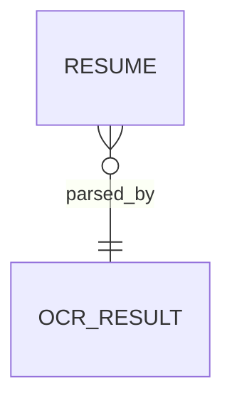

**完整句子**：
- RESUME **is parsed by** OCR_RESULT
- 履歷**被** OCR **解析**

**業務意義**：
- 被動關係
- 強調「被處理」的過程
- OCR 是處理的結果

**主動 vs 被動**：
```
主動：OCR_RESULT parses RESUME
被動：RESUME parsed_by OCR_RESULT
```

---

## 🎨 如何選擇關聯動詞？

### 決策流程圖

```
開始
  ↓
是創造/生成關係？
  ├─ 是 → creates / generates / produces
  └─ 否 ↓
是從屬關係？
  ├─ 是 → belongs_to / contains
  └─ 否 ↓
是需求關係？
  ├─ 是 → requires / needs
  └─ 否 ↓
是定義關係？
  ├─ 是 → defines / specifies
  └─ 否 ↓
是處理關係？
  ├─ 是 → processes / parses / analyzes
  └─ 否 ↓
通用關係 → has / uses
```

---

## 📋 動詞分類

### 按照業務性質分類

#### 創造類（Creation）
- `creates`：創造
- `generates`：生成
- `produces`：產生
- `triggers`：觸發

**使用場景**：主表主動創造從表

---

#### 從屬類（Ownership）
- `has`：擁有
- `contains`：包含
- `belongs_to`：屬於（反向）
- `owns`：擁有（更強調所有權）

**使用場景**：表達擁有或包含關係

---

#### 定義類（Definition）
- `defines`：定義
- `specifies`：指定
- `declares`：聲明

**使用場景**：主表是標準或規範

---

#### 需求類（Requirement）
- `requires`：需要
- `needs`：需要
- `demands`：要求

**使用場景**：主表對從表有需求

---

#### 處理類（Processing）
- `processes`：處理
- `analyzes`：分析
- `parses`：解析
- `transforms`：轉換

**使用場景**：表達資料處理流程

---

#### 關聯類（Association）
- `matches_with`：匹配
- `links_to`：連結到
- `associates_with`：關聯
- `participates_in`：參與

**使用場景**：表達配對或關聯關係

---

#### 動作類（Action）
- `submits`：提交
- `receives`：接收
- `sends`：發送
- `completes`：完成

**使用場景**：表達具體業務動作

---

#### 建議類（Suggestion）
- `suggests`：建議
- `recommends`：推薦
- `proposes`：提議

**使用場景**：AI 或系統給出建議

---

## 🎯 Career Pilot 實例深度解析

### 實例 1：履歷生成流程

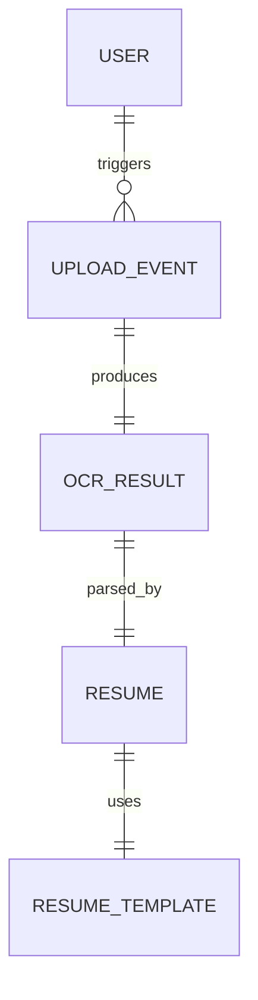

**業務流程解讀**：
1. 使用者**觸發**上傳事件（`triggers`）
2. 上傳事件**產生** OCR 結果（`produces`）
3. OCR 結果**解析**成履歷（`parsed_by`，被動）
4. 履歷**使用**模板（`uses`）

**為什麼用不同動詞？**
- `triggers`：強調使用者的主動觸發
- `produces`：強調系統自動產生
- `parsed_by`：強調被動處理
- `uses`：強調工具性關係

---

### 實例 2：職缺媒合流程

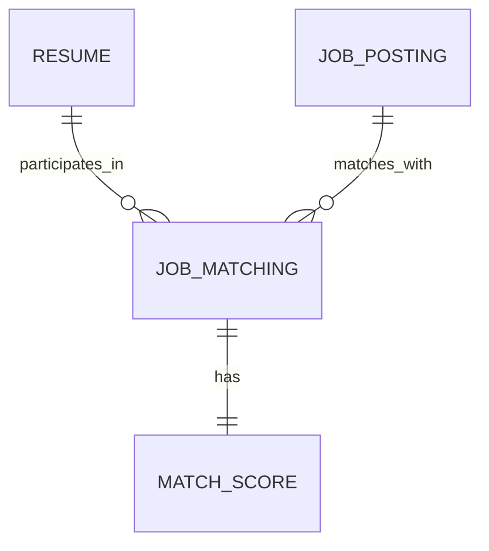

**業務流程解讀**：
1. 履歷**參與**媒合（`participates_in`）
2. 職缺**匹配**媒合（`matches_with`）
3. 媒合記錄**擁有**分數（`has`）

**為什麼用不同動詞？**
- `participates_in`：履歷是被動參與
- `matches_with`：職缺是主動配對
- `has`：一對一擁有關係

---

### 實例 3：技能系統

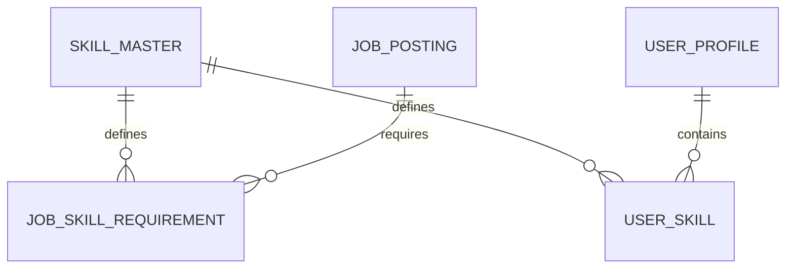

**業務流程解讀**：
1. 技能主檔**定義**職缺技能需求（`defines`）
2. 技能主檔**定義**使用者技能（`defines`）
3. 職缺**需要**技能（`requires`）
4. 使用者檔案**包含**技能（`contains`）

**為什麼都是不同動詞？**
- `defines`：技能主檔作為標準定義
- `requires`：職缺表達需求
- `contains`：使用者檔案包含技能清單

---

## 💡 關聯動詞命名最佳實踐

### 1. 使用現在式動詞

✅ **正確**：`creates`、`has`、`defines`  
❌ **錯誤**：`created`、`having`、`definition`

---

### 2. 從主表的角度命名

```mermaid
USER ||--o{ RESUME : creates
```

**思考邏輯**：「USER（主表）對 RESUME（從表）做什麼？」
- → USER **creates** RESUME

---

### 3. 使用具體動詞優於抽象動詞

✅ **好**：`requires`（需要）、`defines`（定義）  
⚠️ **普通**：`has`（擁有）、`uses`（使用）

**例外**：一對一關係通常用 `has` 就夠了

---

### 4. 保持一致性

同樣類型的關係使用同樣的動詞：

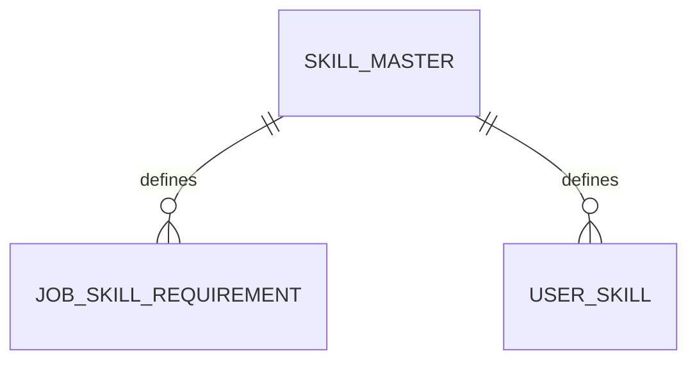

**一致性**：都是「技能主檔定義技能引用」，所以都用 `defines`

---

### 5. 避免過於技術性的動詞

❌ **不好**：`fk_references`、`joins_with`  
✅ **好**：`belongs_to`、`associates_with`

**原因**：ERD 圖要給業務人員看懂

---

## 🎓 進階技巧：雙向動詞

### 正向 vs 反向

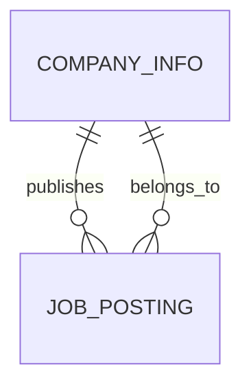

**從不同角度描述同一個關係**：
- 正向（公司 → 職缺）：`publishes`（發布）
- 反向（職缺 → 公司）：`belongs_to`（屬於）

**Mermaid 只需要寫一個方向**，但業務上兩個方向都有意義！

---

## 📝 快速參考表

| 中文 | 英文動詞 | 適用關係 | 範例 |
|-----|---------|---------|------|
| 建立 | creates | 1:N | USER creates RESUME |
| 擁有 | has | 1:1 | USER has USER_PROFILE |
| 定義 | defines | 1:N | SKILL_MASTER defines JOB_SKILL_REQUIREMENT |
| 需要 | requires | 1:N | JOB_POSTING requires JOB_SKILL_REQUIREMENT |
| 屬於 | belongs_to | N:1 | JOB_POSTING belongs_to COMPANY_INFO |
| 包含 | contains | 1:N | USER_PROFILE contains USER_SKILL |
| 參與 | participates_in | 1:N | RESUME participates_in JOB_MATCHING |
| 產生 | produces | 1:1 | UPLOAD_EVENT produces OCR_RESULT |
| 使用 | uses | N:1 | RESUME uses RESUME_TEMPLATE |
| 觸發 | triggers | 1:N | USER triggers UPLOAD_EVENT |
| 匹配 | matches_with | N:N | JOB_POSTING matches_with JOB_MATCHING |
| 建議 | suggests | 1:N | SKILL_GAP suggests SIDE_PROJECT_RECOMMENDATION |

---

## ✅ 總結

### 關聯動詞的三大作用

1. **提高可讀性**：讓非技術人員也能看懂 ERD
2. **表達業務邏輯**：說明資料表之間的實際關係
3. **輔助理解**：幫助開發者理解系統設計意圖

### 選擇動詞的黃金法則

**「如果你要向業務人員解釋這個關係，你會用什麼動詞？」**

---

**文件製作**：Career Pilot 資料組  
**最後更新**：2026-01-18